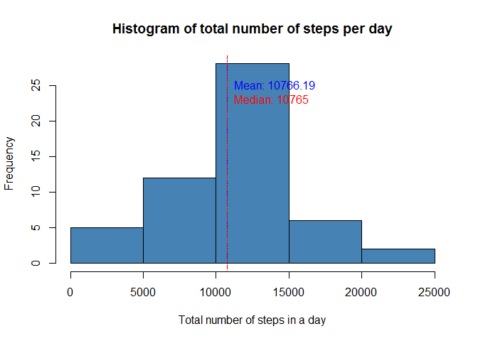
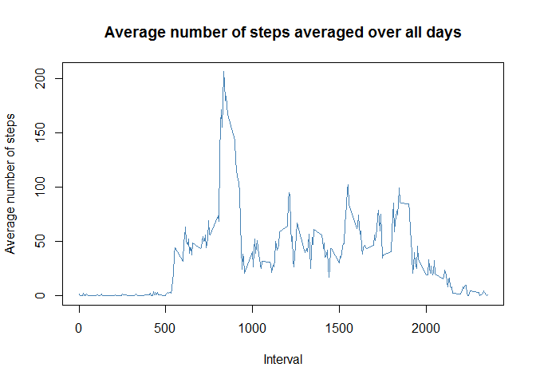
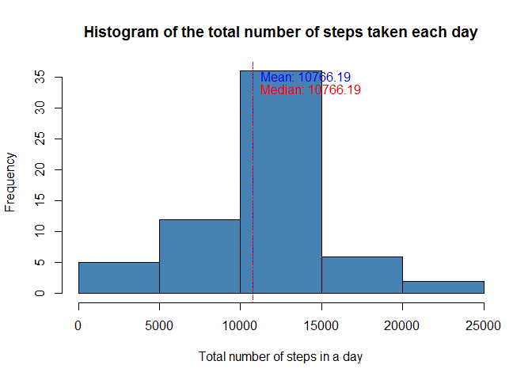
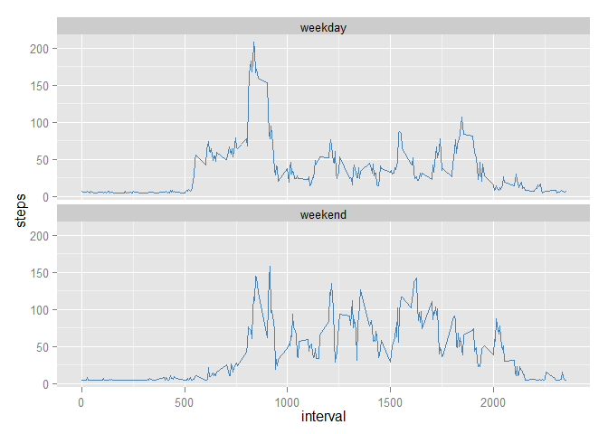
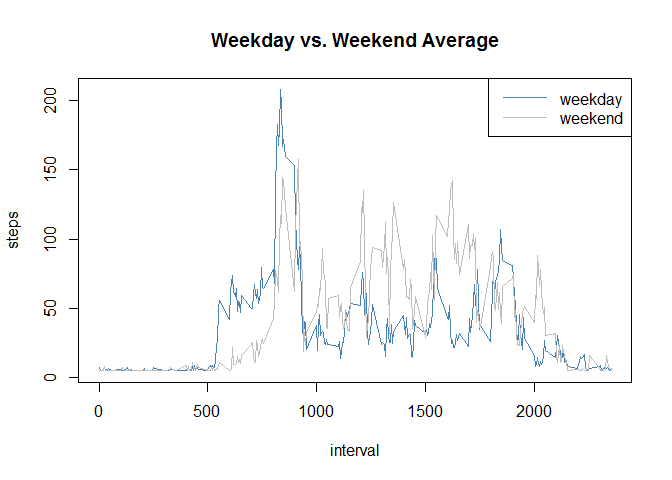

# Reproducible Research: Peer Assessment 1
José Manuel Prieto  

This assignment makes use of data from a personal activity monitoring device. This device collects data at 5 minute intervals through out the day. The data consists of two months of data from an anonymous individual collected during the months of October and November, 2012 and include the number of steps taken in 5 minute intervals each day.
Data

The data for this assignment can be downloaded from the course web site: [Activity monitoring data](https://d396qusza40orc.cloudfront.net/repdata%2Fdata%2Factivity.zip) [^1]

The variables included in this dataset are:

- steps: Number of steps taking in a 5-minute interval (missing values are coded as NA)

- date: The date on which the measurement was taken in YYYY-MM-DD format

- interval: Identifier for the 5-minute interval in which measurement was taken

The dataset is stored in a comma-separated-value (CSV) file and there are a total of 17,568 observations in this dataset.

## Basic settings


```r
echo = TRUE  # Code visible
options(scipen = 1)  # No scientific notations for numbers
```

## Loading and preprocessing the data


```r
unzip("activity.zip")
adata <- read.csv("activity.csv", colClasses = c("integer", "Date", "integer"))
head(adata)
```

```
##   steps       date interval
## 1    NA 2012-10-01        0
## 2    NA 2012-10-01        5
## 3    NA 2012-10-01       10
## 4    NA 2012-10-01       15
## 5    NA 2012-10-01       20
## 6    NA 2012-10-01       25
```

## What is mean total number of steps taken per day?

> For this part of the assignment, you can ignore the missing values in the dataset.


```r
adata.completecases <- na.omit(adata)
```

> 1. Make a histogram of the total number of steps taken each day


```r
steps.by.day <- aggregate(steps ~ date, data=adata.completecases, FUN=sum)

hist(steps.by.day$steps, col="steelblue", main="Histogram of total number of steps per day", 
     xlab="Total number of steps in a day")
abline(v=mean(steps.by.day$steps), lty=3, col="blue")
abline(v=median(steps.by.day$steps), lty=4, col="red")
text(mean(steps.by.day$steps),25,labels=paste("Mean:",round(mean(steps.by.day$steps),2),sep=" "), pos=4, col="blue")      # label the mean  
text(median(steps.by.day$steps),23,labels=paste("Median:",round(median(steps.by.day$steps),2),sep=" "), pos=4, col="red") 
```

 

> 2. Calculate and report the mean and median total number of steps taken per day

### Mean


```r
mean(steps.by.day$steps)
```

```
## [1] 10766.19
```

### Median


```r
median(steps.by.day$steps)
```

```
## [1] 10765
```

## What is the average daily activity pattern?

> 1. Make a time series plot (i.e. type = "l") of the 5-minute interval (x-axis) and the average number of steps taken, averaged across all days (y-axis)


```r
steps.by.interval <- aggregate(steps ~ interval, data= adata.completecases, FUN=mean)
plot(steps.by.interval$interval, steps.by.interval$steps, type='l', col="steelblue", 
     main="Average number of steps averaged over all days", xlab="Interval", 
     ylab="Average number of steps")
```

 

> 2. Which 5-minute interval, on average across all the days in the dataset, contains the maximum number of steps?


```r
rowID <- which.max(steps.by.interval$steps) #row id of maximum average number of steps in an interval
steps.by.interval [rowID, ] # interval with maximum average number of steps in an interval
```

```
##     interval    steps
## 104      835 206.1698
```

## Imputing missing values

> Note that there are a number of days/intervals where there are missing values (coded as NA). The presence of missing days may introduce bias into some calculations or summaries of the data.

> 1. Calculate and report the total number of missing values in the dataset (i.e. the total number of rows with NAs)


```r
length(which(is.na(adata))) # Checking for incomplete cases on the entire set
```

```
## [1] 2304
```

> 2. Devise a strategy for filling in all of the missing values in the dataset. The strategy does not need to be sophisticated. For example, you could use the mean/median for that day, or the mean for that 5-minute interval, etc.

Filling missing values in the dataset with the mean.

> 3. Create a new dataset that is equal to the original dataset but with the missing data filled in.


```r
adata.new <- adata
adata.new$steps[is.na(adata.new$steps)] <- mean(na.omit(adata$steps))
```

> 4. Make a histogram of the total number of steps taken each day and Calculate and report the mean and median total number of steps taken per day. Do these values differ from the estimates from the first part of the assignment? What is the impact of imputing missing data on the estimates of the total daily number of steps?


```r
steps.by.day.new <- aggregate(steps ~ date, data=adata.new, FUN=sum)
hist(steps.by.day.new$steps, col="steelblue", main="Histogram of the total number of steps taken each day", xlab="Total number of steps in a day")
abline(v=mean(steps.by.day.new$steps), lty=3, col="blue")
abline(v=median(steps.by.day.new$steps), lty=4, col="red")
text(mean(steps.by.day.new$steps),35,labels=paste("Mean:",round(mean(steps.by.day.new$steps),2),sep=" "), pos=4, col="blue")    
text(median(steps.by.day.new$steps),33,labels=paste("Median:",round(median(steps.by.day.new$steps),2),sep=" "), pos=4, col="red")
```

 

### Mean


```r
mean(steps.by.day.new$steps)
```

```
## [1] 10766.19
```

### Median


```r
median(steps.by.day.new$steps)
```

```
## [1] 10766.19
```

> Imputing values did not change the mean and slightly increased median.


## Are there differences in activity patterns between weekdays and weekends?

For this part the `weekdays()` function may be of some help here. Use the dataset with the filled-in missing values for this part.

> 1. Create a new factor variable in the dataset with two levels - "weekday" and "weekend" indicating whether a given date is a weekday or weekend day.


```r
Sys.setlocale("LC_TIME", "English") # Change Locale to English (I'm spanish)
```

```
## [1] "English_United States.1252"
```

```r
## function to put day type
daytype <- function(date) {
    if (weekdays(as.Date(date)) %in% c("Saturday","Sunday")) {
        "weekend"
    } else {
        "weekday"
    }
}
adata.new$day <- as.factor(sapply(adata.new$date, daytype))
```

> 2. Make a panel plot containing a time series plot (i.e. `type = "l"`) of the 5-minute interval (x-axis) and the average number of steps taken, averaged across all weekday days or weekend days (y-axis).


```r
library(ggplot2) # panel plot
steps.new <- aggregate(steps ~ interval + day, data=adata.new, FUN=mean)
ggplot(steps.new, aes(x=interval, y=steps, group=1)) + geom_line(colour = "steelblue") + facet_wrap(~ day, ncol=1)
```

 

```r
## Together. Plot weekday over weekend
par(mfrow=c(1,1))  
with(steps.new, plot(steps ~ interval, type="n", main="Weekday vs. Weekend Average"))  
with(steps.new[steps.new$day == "weekday",], lines(steps ~ interval, type="l", col="steelblue"))  
with(steps.new[steps.new$day == "weekend",], lines(steps ~ interval, type="l", col="grey" ))  
legend("topright", lty=c(1,1), col = c("steelblue", "grey"), legend = c("weekday", "weekend"), seg.len=3)
```

 

[^1]: The GitHub repository also contains the dataset for the assignment so you do not have to download the data separately.
